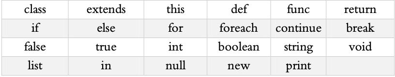
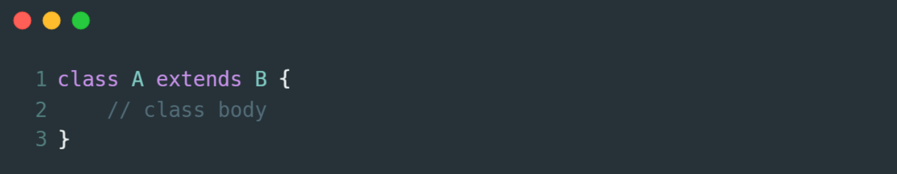
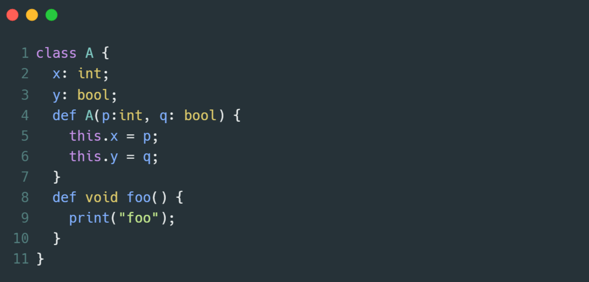
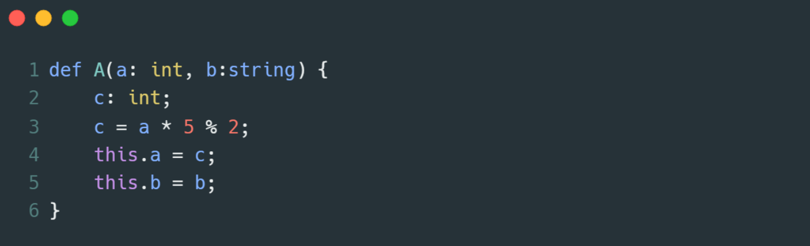
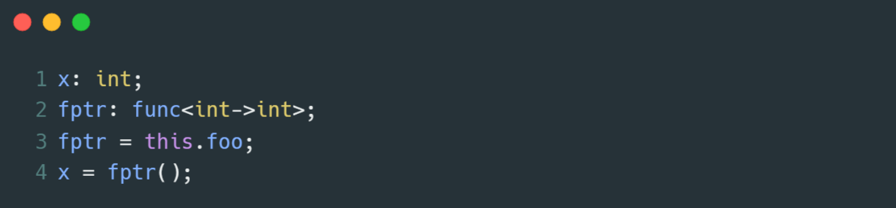
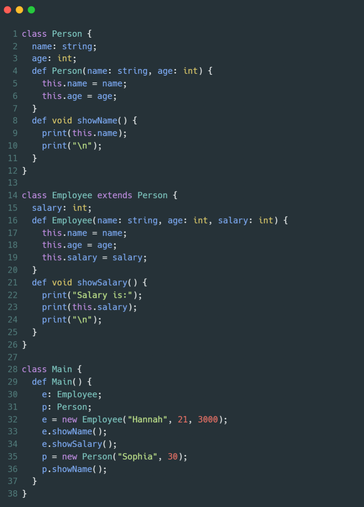

# Sophia-Compiler

A compiler made for the Sophia language. This project is created using antlr4 and Java and is run on JVM.

## Sophia Language

Sophia is an object-oriented programming language made as a learning project during the Compilers and Programming Languages course at the University of Tehran. Generally speaking, Sophia is a blend of C++ and Javascript with some differences.

### Keywords

Sophia is a somewhat complex language. It uses the following keywords:

### Naming variables

Variables can have any name created using [a-zA-z0-9] and [_]; However, a variable name can't start with a number.

### Classes

Classes in Sophia are defined using the **class** keyword. Here is an example of such definitions:

Classes can have attributes and methods. More on the definition of such parts will come later. A sample of an entire class is attached below:

All classes require a constructor to tell the compiler how to create an object of the course. One example of a constructor is attached below:

### Variable Types

Sophia supports ***int, bool, and string*** primitive types and also supports lists and function pointers. An example of a function pointer is attached below:

### Sample code

A sample Sophia program has been attached below:

## Implementation

Sophia was programmed in 4 Phases:

* Implement a Lexer and a Parser using antlr4 to generate tokens and a parse tree.
* Gathering class information, including definitions and scopes.
* Type checks and final error checkings.
* Translating the code to Java Byte Code to be run on JVM.

Each Phase is available as a separate branch, but phase-4 contains all the previous phases.

## Running The Code

To run the code, you can use the following command:

    make

Remember that to run the Makefile, you must have had installed Antlr4 and Java on your system and edit the Makefile to point at your installation paths.

## Acknowledgments

This project was programmed by Sina Kamali & Sina Negarandeh at the University of Tehran. This README is written by [Sina Kamali](https://github.com/kamali-sina/Sophia-Compiler/blob/phase-4/).
